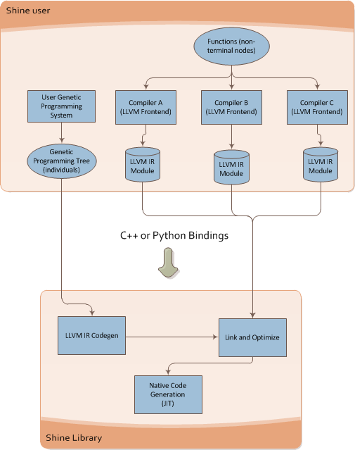

Introduction
===============================================================================

.. _ASTs: http://en.wikipedia.org/wiki/Abstract_syntax_tree
.. _LLVM IR: http://llvm.org/docs/LangRef.html
.. _LLVM Passes: http://llvm.org/docs/Passes.html
.. _LTO: http://en.wikipedia.org/wiki/Link-time_optimization
.. _Clang: http://clang.llvm.org/
.. _llvm-gcc: http://www.llvm.org/docs/CommandGuide/html/llvmgcc.html
.. _CMake: http://www.cmake.org/
.. _Sphinx: http://sphinx.pocoo.org/
.. _Doxygen: http://www.stack.nl/~dimitri/doxygen/

What is Shine ?
-------------------------------------------------------------------------------
Shine is a library that automatically makes the code generation of the `LLVM IR`_
(Intermediate Representation) from the user Genetic Programming trees.
It also provides an easy API for optimizing and JITing Genetic Programming
`ASTs`_ into native code.

.. note:: Genetic Programming literature often call individuals as *trees*,
          *syntax trees* or *abstract syntax trees* (`ASTs`_), we'll adopt the term
          AST (Abstract Syntax Tree) here and in the library itself.

Architecture Design
-------------------------------------------------------------------------------
The follow image shows an overview of the Shine architecture:

.. figure:: images/shine_process_overview.png
   :align: center

Shine takes as input the individuals (`ASTs`_) of your Genetic Programming system and
then creates the `LLVM IR` assembly. Shine uses the `LLVM Passes`_ to optimize this
generated assembly code; here is some examples showing how these transformation
passes work on your Genetic Programming individuals:

**Instruction Combine** - *Combine redundant instructions*

It combines instructions like:

.. code-block:: llvm

    %Y = add i32 %X, 1
    %Z = add i32 %Y, 1

into:

.. code-block:: llvm

    %Z = add i32 %X, 2

**Constant Propagation**

This transformation implements the constant propagation and merging, example:

.. code-block:: llvm

    add i32 1, 2

is transformed into:

.. code-block:: llvm

    i32 3

.. note:: These are just two examples of how the LLVM's Transformations works, for more information see the
          LLVM's Analysis and Transform Passes guide.

In the diagram below, you can see how Shine interacts with the user's Genetic Programming system:

The first step is the preparation of the non-terminal (funcions) code, actually, the definition
of the functions that will be used in your ASTs can be done in any language that supports
the LLVM IR generation (you can use Clang, llvm-gcc, etc...) to create the functions, in simple
terms, you can define your functions using C/C++ for example.

After compiling your GP functions to LLVM IR (bitcode), you just need to plug them into the
Shine library and link all of them together (if you have more than one bitcode object file). Shine
library also has an optional step of `LTO`_ (*Link-time optimization*), in which you can optimize
the linking between your multiple LLVM IR modules.

Now that you have your functions loaded into Shine library, all you need is to prepare an array
with your AST nodes (this array is built using a **pre-order traversal** of your GP AST). After
that, you will use Shine library to create, optimize and JIT the LLVM IR of your AST, to finally
get a function pointer to your GP individual in native code.

.. seealso::
    
    `LLVM's Analysis and Transform Passes <http://llvm.org/docs/Passes.htm>`_

    `LLVM Assembly Language Reference <http://llvm.org/docs/LangRef.html>`_

Requirements
-------------------------------------------------------------------------------
In order to compile and use Shine, you'll need the follow libraries/tools:

**A LLVM IR compatible compiler**

    This compiler will be used to create the LLVM IR of your Genetic Programming system, you can
    use `Clang`_, `llvm-gcc`_, etc.

**LLVM - The Low-Level Virtual Machine**

    You'll need the version 2.9+ of the `LLVM Compiler Infrastructure <http://www.llvm.org/releases/>`_.

    **Version tested:** 2.9

**CMake**
    
    The `CMake`_ is used to create tha Makefiles.
    
    **Version tested:** 2.8

**GLib 2.x.x+** *(optional)*

    You'll only need the GLib if you'll need to compile the tests.

    **Version tested:** 2.26.1

**Sphinx** *(optional)*

    The `Sphinx`_ was used to create the non-API documentation of the library.

    **Version tested:** 1.0.7

**Doxygen** *(optional)*

    The `Doxygen`_ was used to create the API documentation of the library.

    **Version tested:** 1.7.1

Installation
-------------------------------------------------------------------------------
sdffd

